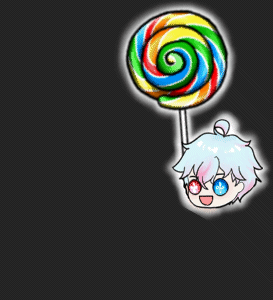
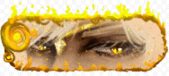
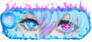
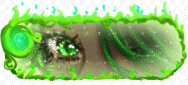
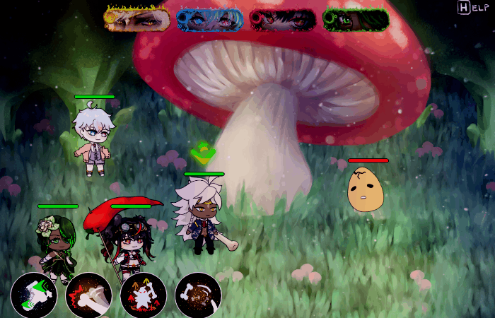
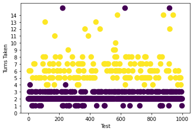
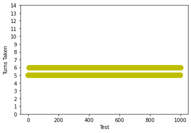
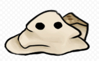
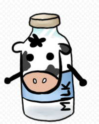
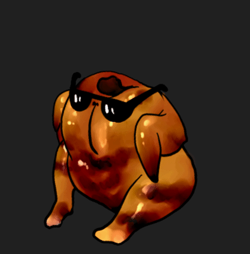

# Ambrosia
A 2D turn-based RPG made in a collaborative team of six.

*Taji is telling you to really check this out.*  
  
*psst, it's available for download in [releases](https://github.com/Emma-tx-L/Ambrosia/releases/tag/v0.1)*

## Features Overview
- strategic turn-based combat
- written without an engine in C++, GLSL, and basic ECS
- 2D animated sprite graphics
- 4 playable characters with diverse lore, personality, and strategic skills
- diverse enemy AI with various mechanics that heal, rely on rng, and self-destruct
- 3 different playthroughs with unique bosses + intro tutorial
- store, currency, and character upgrade system

## Playable Characters
  
Raoul, Taji, Ember, and Chia are passionate food-connoisseur who have banded together to save a world corrupted by 'Ambrosia', a mysterious flavour-stealing power. Learn more about them and see their cool skills in game!  

## Hand-painted Maps
*GLSL shader lighting*  
  
*Parallax*  

## Tutorial 
  
*What just happened?!* Guess you gotta play to find out!

## In-Game Tips
*Cause it's not as easy as it looks!*  

## Strategic Gameplay
Simulations of possible player choices show that you *do* need strategy to win. Each character has the ability to impact the entire team, and choosing the right combination of skills and targets will get you a sure win!  
    
Graphs of turns taken vs. simulation number. Purple means the game resulted in defeat. Yellow means the game resulted in victory. Left is Random Strategy, Right is Flawless Strategy.

[**A full report of strats and stats is included in the repo here.**](data/balancing/balancing.md)

## Defeat Ambrosia-tainted Enemies
  
Each in-game enemy has a unique set of skills and animations.

## Emerge Victorious! ... Hopefully

# [Available in Releases](https://github.com/Emma-tx-L/Ambrosia/releases/tag/v0.1)

## My Main Contributions
- graphical assets and animations
- main menu music
- animation system and animated shader
- gameplay, enemy, and character design
- gameplay statistics analysis
- tutorial system
- inspect (in-game tips) system
- lighting shader

## Other Tech Used
- 2D assets - Paint Sai
- Animations - Live2D Cubism
- Music - LMMS
- Gameplay Analysis - Python

## ~~Ambrosia Besties~~(Collaborators)
- Jacques Marais
- Matthew Ng
- Christine Song
- Alexander Neumann
- Louise Hsu
